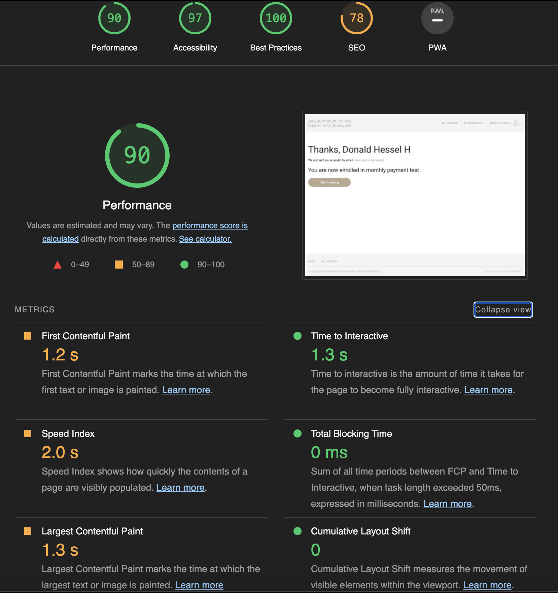
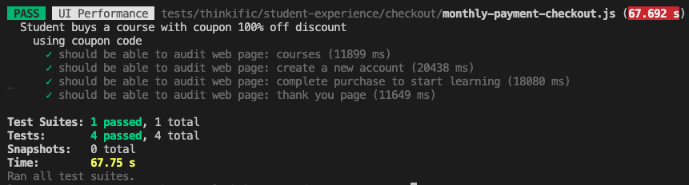
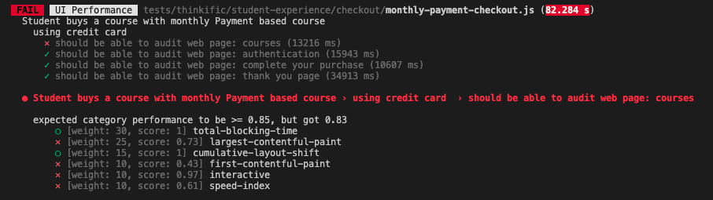

# UI Performance Tests
Testing framework to evaluate frontend performance of a set of user journey steps with **Lighthouse** on Thinkific website.

## Installing

1. Clone the repository: `git clone https://github.com/LerryAlexander/lighthouse-performance-tests.git`
2. Install and use node version 14.15.5: `nvm install 14.15.5` and then `nvm use 14.15.5`  
3. Install dependencies: `npm install`

## Using

Te overall idea of this repo is running Lighthouse tests on each webpage visited during a user journey steps to check the performance and obtain improvement opportunities from the frontend metrics results.  

By default, these tests run with **default thresholds** on **production** environment and **headless** mode by running:

### `npm run test`

Usage examples:

- `npm run test --THRESHOLDS=custom`: run tests with custom thresholds defined in `config/lighthouse/thresholds.js`
- `npm run test --DEBUG=true`: run tests on `headless = false` and slow motion slower `slowMo = 15` for better debugging.
- `npm run test --TESTENV=development`: run tests against `development` environments instead of production environment.

Environment variables options:

- `--THRESHOLDS`: can be either `default` or `custom`. (`default` is set as default value).
- `--DEBUG`: can be either `true` or `false`. (`false` is set as default value).
- `--TESTENV`: can be either `development` or `production`. (`production` is set as default value).

## Results

Test reports generated by lighthouse can be found at: `results/`

### Summary report

Also there is a nice report that can be watched from console results:

> Success example

> Failed example

